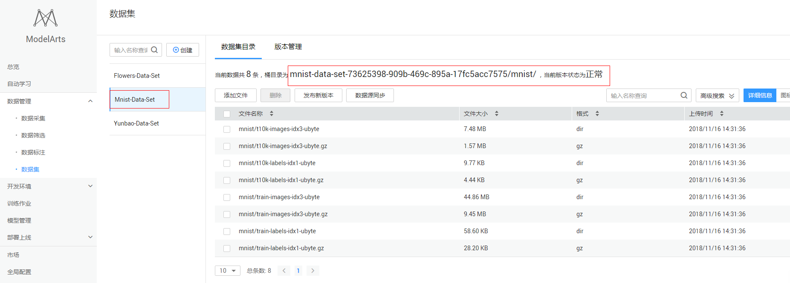

# Use TensorFlow to realize the application of handwritten digital image recognition.

This document describes how to use TensorFlow to implement handwritten digital image recognition for MNIST data sets on Huawei cloud ModelArts platform. The operation process consists of four parts:

The basic process includes the following steps:

1. ** Data to be prepared **: Create the required data set version through the ModelArts market preset data set.
2. ** training model **: Use the TensorFlow framework training script to create a training job for model training.
3. ** forecast result **: After obtaining the training model file, create a training job to predict the test data set and output the prediction result.

Data to be prepared for the ### 1.
To create the required data set version through the ModelArts market preset data set, perform the following steps:

** Step 1** &#160; &#160; Log in to the [ModelArts](https://console.huaweicloud.com/modelarts/?region=cn-north-1#/manage/dashboard) management console and add an access key on the Global Configuration page. See Figure 1.

Figure 1 Adding an access key

.

** Step 2** &#160; &#160; Return to the ModelArts management console and click Market in the navigation tree on the left. Switch to the Data Set page of the ModelArts market and find the Mnist-Data-Set data set.

** Step 3** &#160; &#160; Go to the details page of the preset data set Mnist-Data-Set and execute Import to My Data Set. The Data Management > Data Set page is displayed.

** Step 4** &#160; &#160; On the Data Management > Data Set page of the ModelArts management console, check whether the data details are completely loaded after the mnist data set (Mnist-Data-Set) is created.

** Step 5** &#160; &#160; Obtain the bucket information mnist-data-set-73625398-909b-469c-895a-17fc5acc7575/mnist/ of the created mnist data set on the data set directory page. See the following figure.

Figure 2 Data set

### 2. training model
Next, compile the model training script code (the training script has been written in this case) and complete the model training. The procedure is as follows:

** Step 1** &#160; &#160; Download the model training script file [train\_mnist\_tf.py](https://github.com/huawei-clouds/modelarts-example/blob/master/Using%20TensorFlow%20to%20Create%20a%20MNIST%20Dataset%20Recognition%20Application/codes/train_mnist_tf.py). upload the script file to the Huawei cloud OBS bucket by referring to section </a> "Uploading Service Data" in <a href="https://support.huaweicloud.com/usermanual-dls/dls_01_0040.html">. Assume that the OBS bucket path is /modelarts-example/codes/.

** Step 2** &#160; &#160; On the Training Job page, click Create in the upper left corner, and set Name and Description. Set Data source to Data set Mnist-Data-Set{or Data storage location (mnist-data-set-73625398-909b-469c-895a-17fc5acc7575/mnist/ in this example)}. Set Algorithm Source to Common Framework, AI Engine to TensorFlow", and Code Directory to the parent directory (/modelarts-example/codes/) of the OBS where the training script file train\_mnist\_tf.py is located. Select train\_mnist.py for Startup File, and select a path (for example, /modelarts-example/log/) for Training Output Position to save the output model and prediction file. Fill in the training parameters by referring to the following figure.

Figure 3 Training operation parameter configuration (training)

** If the parameters in step 3** &#160; &#160; are correct, click Create Now to complete the creation of the training job.

** Step 4** &#160; &#160; In the process of model training or after completion, create a TensorBoard job to view statistical information of some parameters, for example, lo

### 3. Forecast Result

After the training job is complete, a model file (for example, model.ckpt-1000) is generated in the Training Output Location directory. Related prediction operations have been written in the train\_mnist\_tf.py file. Therefore, the online prediction service does not need to be deployed. The prediction results are recorded in logs. The following describes how to use a training job for prediction.

** Step 1** &#160; &#160; For details, see **2. Training Model **. On the Training Job page, click Create in the upper left corner.

** Step 2** &#160; &#160; Set parameters. For details, see **2. Training Model Step 2**. Set Training Output Position to the same value (/modelarts-example/log/) and Data Source to Data Storage Location (/modelarts-example/testdata/ in this example), this directory stores the images to be predicted. You need to upload the prediction images to the OBS path. During the prediction, you can select only one computing node. You must add the is_training=False parameter and click Create Now, the prediction job is created.

Figure 5 Forecasting job parameter configuration

** Step 3** &#160; &#160; After the prediction is complete, you can view the prediction result in the job log, as shown in the following figure.

Figure 6 Prediction result

